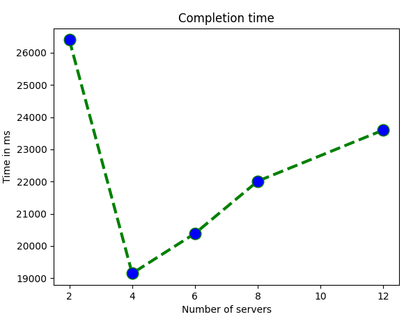

# SLR207

> Project of SLR207 at Télécom Paris - **Artem Golovin**

Implementation of MapReduce concept - Télécom Paris 2022-2023

## Implementation

It's written in Java using Maven manager to configure, compile and create JAR packages.

This is done in the form of an automaton, meaning that each server knows its current state and the state it can go to if it fulfills the necessary conditions.

### Communication

All the communication (between the servers and between the servers and master) is implemented via raw sockets.

### Launch

First you need to start the servers, and then the master program. This is done automatically through the deployment script called deploy.sh

Data to be specified in the script:
1. List of hosts and ports on which to run the servers
2. Host and and port on which to run the master
3. File from which to take data

After altering the script you need just to launch it.

### Splitting

The master node splits the file almost equally into bytes trying to finish words if they are not completed after the split and sends them to the servers in a round-robin manner.

### Mapping

After receiving the split, each server tokenizes the split to get the words from it and locally counts how many times it has encountered this or that word.

### Shuffling & Reducing

This is the first stage in which the servers interact with each other. Its goal is to collect all the same words (and their frequencies respectively) on one single server. Which word is sent to which server is determined by the following formula:

> index of the server = hash(word) % count of servers

Reduce step is applied automatically due to the HashMap specification.

Note:
I think it's important to describe here the communication protocol of this step.

After a server has sent data to other server it must send an ``END`` command to let the receiver know it is done. The receiver must in turn respond with an ``OK`` command, letting know that it has received all the data. This is done to make the servers consistent before moving on to the next step.

### Sort. Mapping

This is the part where we want to make each server responsible for a specific range of word frequencies.

The servers send their local word frequencies to the master, then the master divides the entire frequency range into subranges assigned to each server and sends the data back to the servers.

### Sort. Shuffling & Reducing

All servers send the data that was generated during ``Shuffling & Reducing`` step to the appropriate servers. The same communication protocol is used here.

### Progress output

To make the program more verbose, the information necessary to understand the process is sent to the logger. This information is displayed in the console and saved to the master.log and server.log files for the master and each server, respectively.

## Results

This ran on 300mb files each on Télécom's machines.

The following results (averages of 5 runs) obtained:

2 servers : 26401ms
4 servers : 19146ms
6 servers : 20888ms
8 servers : 22013ms
12 servers : 23601ms

## Conclusion
